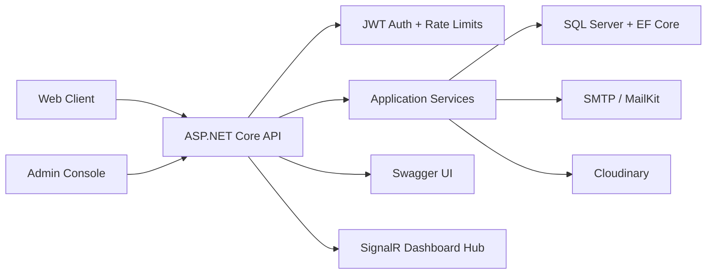

<div align="center">


[](https://dotnet.microsoft.com/)
[](https://learn.microsoft.com/aspnet/core)
[](https://learn.microsoft.com/ef/core/)
[](https://jwt.io/)
[](https://www.docker.com/)


[](#overview)
[](#api-surface)
[](#configuration)
[](#quality-bar)

<a href="#overview">Overview</a> |
<a href="#feature-map">Features</a> |
<a href="#architecture">Architecture</a> |
<a href="#api-surface">API</a> |
<a href="#run-locally">Run Locally</a> |
<a href="#docker">Docker</a>

</div>


## Overview

NileGuide API is the ASP.NET Core backend behind the NileGuide travel platform. It provides the product layer for activity discovery, authentication, user profiles, wishlists, trip planning, reviews, reports, newsletters, and admin operations.

The codebase is designed as a production-facing Web API: typed options are validated at startup, EF Core migrations manage the SQL Server schema, JWT bearer auth protects private flows, rate limiting guards sensitive endpoints, Swagger documents the contract, and SignalR streams dashboard updates.

## Brand Palette

| Token | Color | Usage |
| --- | --- | --- |
| Nile Midnight | `#0F172A` | Primary dark surface, security, admin tone |
| Nile Blue | `#0369A1` | API/navigation identity |
| Oasis Teal | `#14B8A6` | Success, realtime, discovery highlights |
| Sun Gold | `#F59E0B` | Premium accent and callouts |

## Feature Map

| Product Area | What It Handles |
| --- | --- |
| Authentication | Register, login, logout, refresh tokens, current user, password reset code flow |
| Discovery | Activities, categories, cities, filters, details, images, hours, booking links |
| User Workspace | Profile preferences, profile pictures, wishlists, trip plan items |
| Social Proof | Activity reviews, reviewer metadata, rating aggregation support |
| Admin Console | Activity CRUD, user management, dashboard metrics, reports, newsletter send |
| Platform Services | SQL Server, EF Core migrations, JWT, MailKit, Cloudinary, SignalR, Swagger |

## Technology

<div align="center">

[](https://skillicons.dev)

</div>

| Layer | Stack |
| --- | --- |
| Runtime | .NET 8, ASP.NET Core Web API |
| Persistence | SQL Server or Azure SQL, Entity Framework Core 8 |
| Security | JWT bearer tokens, refresh tokens, role-based admin policy |
| Realtime | SignalR dashboard hub |
| Email | MailKit SMTP |
| Media | Cloudinary profile picture uploads |
| Documentation | Swagger / OpenAPI with XML comments and operation filters |
| Deployment | Docker-ready ASP.NET Core container |

## Architecture



## Project Structure

```text
NileGuideApi/
  Controllers/      HTTP endpoints grouped by product area
  Data/             AppDbContext and design-time EF factory
  DTOs/             Request and response contracts
  Hubs/             SignalR hubs
  Middleware/       Centralized API exception handling
  Migrations/       EF Core database migrations
  Models/           Domain entities
  Options/          Typed configuration objects
  Services/         Business logic and integrations
  Swagger/          Swagger filters and response examples
```

## API Surface

| Area | Routes |
| --- | --- |
| Auth | `POST /api/auth/register`, `POST /api/auth/login`, `GET /api/auth/me`, `POST /api/auth/refresh`, `POST /api/auth/logout` |
| Password Reset | `POST /api/auth/forgot-password`, `POST /api/auth/verify-reset-code`, `POST /api/auth/reset-password` |
| Activities | `GET /api/activities`, `GET /api/activities/{id}` |
| Reviews | `GET /api/activities/{activityId}/reviews`, `POST /api/activities/{activityId}/reviews` |
| Lookups | `GET /api/categories`, `GET /api/cities` |
| Wishlist | `GET /api/wishlist`, `GET /api/wishlist/activity-ids`, `POST /api/wishlist/{activityId}`, `DELETE /api/wishlist/{activityId}` |
| Plan | `GET /api/plan`, `POST /api/plan/items`, `DELETE /api/plan/items/{planItemId}` |
| Profile | `GET /api/users/me/profile`, `PUT /api/users/me/profile`, profile picture upload/delete |
| Chat | `POST /api/chat/conversations`, `GET /api/chat/conversations`, `DELETE /api/chat/conversations/{conversationId}` |
| Admin | `api/admin/activities`, `api/users`, `api/dashboard`, `api/reports/*`, `api/newsletter/send` |

Swagger is available at:

```text
/swagger
```

## Requirements

- .NET SDK `8.0.420` or a compatible .NET 8 SDK
- SQL Server or Azure SQL
- EF Core CLI tools
- SMTP credentials for email flows
- Cloudinary credentials for profile image uploads

```bash
dotnet tool install --global dotnet-ef
```

## Configuration

The API validates required configuration at startup. Do not commit real values, connection strings, credentials, tokens, provider keys, or production hostnames. Use local user secrets for development and environment variables in deployed environments.

| Section | Required Keys |
| --- | --- |
| `ConnectionStrings` | `DefaultConnection` |
| `Jwt` | `Key`, `Issuer`, `Audience`, `AccessTokenMinutes`, `RefreshTokenDays`, `RefreshTokenRememberMeDays` |
| `EmailSettings` | `SmtpServer`, `SmtpPort`, `SmtpUsername`, `SmtpPassword`, `FromEmail`, `FromName` |
| `Security` | `ResetCodePepper` |
| `Cloudinary` | `CloudName`, `ApiKey`, `ApiSecret` |

Use ASP.NET Core's double-underscore convention for environment variables:

```text
ConnectionStrings__DefaultConnection
Jwt__Key
Security__ResetCodePepper
EmailSettings__SmtpPassword
Cloudinary__ApiSecret
```

For local development, set real values with `dotnet user-secrets` inside the API project and keep those values outside the repository.

## Run Locally

Restore and build:

```bash
dotnet restore NileGuideApi/NileGuideApi.csproj
dotnet build NileGuideApi/NileGuideApi.csproj
```

Apply database migrations:

```bash
dotnet ef database update --project NileGuideApi/NileGuideApi.csproj
```

Run the API:

```bash
dotnet run --project NileGuideApi/NileGuideApi.csproj
```

The application also runs pending EF Core migrations on startup when a valid database connection is configured.

## Authentication

Protected endpoints require a bearer token:

```http
Authorization: Bearer {accessToken}
```

Admin-only endpoints use the `AdminOnly` authorization policy, which requires the `Admin` role.

## CORS

The API is configured for known frontend origins in application configuration/code. Keep production domains environment-specific and avoid documenting private deployment targets in public repository files.

## Docker

Build the image from the API project directory so the Dockerfile context is correct:

```bash
cd NileGuideApi
docker build -t nileguide-api .
```

Run the container with environment variables or an ignored env file:

```bash
docker run --rm -p 8080:8080 --env-file .env nileguide-api
```

The container listens on port `8080`. Startup requires the same configuration listed above, including a reachable SQL Server connection. The API applies pending EF Core migrations during startup.

## Quality Bar

| Area | Implementation |
| --- | --- |
| Error handling | Central exception middleware returns consistent API errors |
| Validation | Model validation uses a lightweight `{ message, errors }` shape |
| Security | JWT validation, role policies, reset-code pepper, no committed secrets |
| Resilience | SQL retry-on-failure for transient Azure SQL startup failures |
| API contract | Swagger UI, XML comments, auth operation filters, response examples |
| Repository hygiene | Build output, IDE state, local secrets, request samples, and scratch files are ignored |

<div align="center">


</div>
