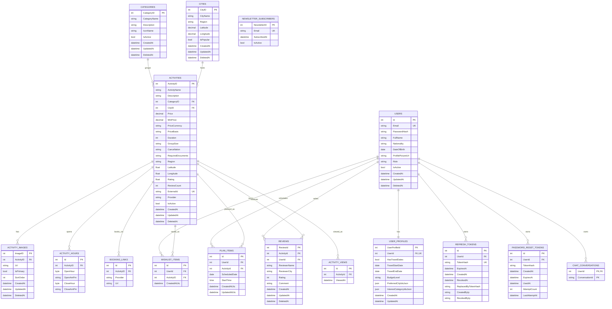

# NileGuideApi Database ERD

Source of truth: `NileGuideApi/Data/AppDbContext.cs` and the current EF Core model snapshot.

Rendered SVG: [DATABASE_ERD-1.svg](./DATABASE_ERD-1.svg)

## Relationship Notes

- `UserProfiles.UserId` is unique, so each user has at most one profile.
- `WishlistItems` and `PlanItems` are join-style tables between `Users` and `Activities`.
- `Reviews.UserId` uses restrict delete behavior; most other user/activity dependent tables cascade.
- `NewsletterSubscribers` is standalone and is not linked to `Users`.
- `UserProfiles.PreferredCityIdsJson` and `UserProfiles.InterestCategoryIdsJson` store IDs as JSON arrays, not enforced foreign keys.

## Important Indexes And Constraints

- `Users.Email` is unique.
- `Activities.ExternalId` is unique when it is not null.
- `RefreshTokens.TokenHash` is unique.
- `NewsletterSubscribers.Email` is unique.
- `WishlistItems` has a unique composite index on `(UserId, ActivityID)`.
- `PlanItems` has a unique composite index on `(UserId, ActivityId)`.
- `ChatConversations` uses composite primary key `(UserId, ConversationId)`.
- `ActivityHours` constrains `OpenHour` and `CloseHour` to `1..12`, and `OpenAmPm` / `CloseAmPm` to `AM` or `PM`.
